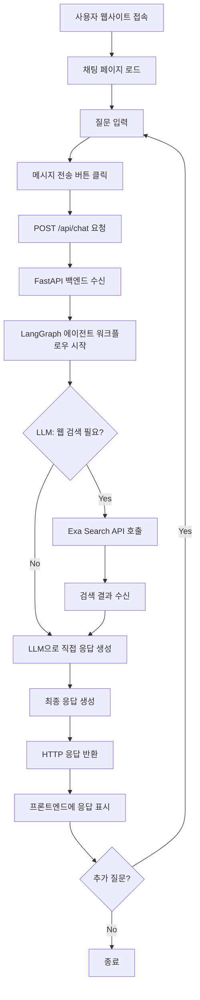
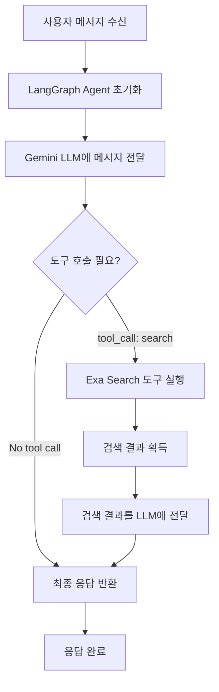

# 웹검색 챗봇 에이전트 - Product Requirements Document (PRD)

## 1. 문제 정의

### 1.1 배경
기존 AI 챗봇은 학습된 데이터에 기반하여 응답을 생성하기 때문에, 실시간으로 변화하는 정보나 최신 이슈에 대한 질문에 정확하게 답변하는 데 한계가 있습니다.

### 1.2 해결하고자 하는 문제
- 최신 뉴스, 날씨, 주가, 스포츠 경기 결과 등 실시간 정보가 필요한 질문에 대한 정확한 응답 제공 부족
- 사용자가 검색 엔진과 AI 챗봇을 별도로 사용해야 하는 불편함
- 검색 결과를 AI가 이해하고 종합하여 제공하는 통합 솔루션의 부재

### 1.3 목표
웹 검색 기능을 통합한 AI 챗봇 에이전트를 구축하여, 사용자가 최신 정보가 필요한 질문을 했을 때 자동으로 웹을 검색하고, 검색 결과를 바탕으로 정확하고 유용한 답변을 제공하는 프로토타입을 개발합니다.

---

## 2. 요구사항

### 2.1 기능 요구사항

#### FR-001: 채팅 인터페이스
- 사용자는 웹 페이지에서 텍스트 입력창을 통해 질문을 입력할 수 있어야 합니다
- 입력한 메시지는 전송 버튼 또는 Enter 키를 통해 전송할 수 있어야 합니다
- 사용자 메시지와 에이전트 응답이 채팅 형태로 화면에 표시되어야 합니다

#### FR-002: 메시지 전송 및 응답
- 사용자가 메시지를 전송하면 POST 방식의 HTTP 요청으로 백엔드 API에 전달되어야 합니다
- API 엔드포인트: `POST /api/chat`
- 요청 본문: `{"message": "사용자 질문"}`
- 응답 형식: `{"response": "에이전트 답변"}`

#### FR-003: 웹 검색 필요 여부 자동 판단
- LLM이 사용자의 질문을 분석하여 웹 검색이 필요한지 자동으로 판단해야 합니다
- 최신 정보, 실시간 데이터, 특정 사실 확인이 필요한 경우 웹 검색을 수행해야 합니다
- 일반적인 대화나 상식적인 질문은 검색 없이 직접 응답해야 합니다

#### FR-004: 웹 검색 수행
- 웹 검색이 필요하다고 판단되면 Exa Search API를 호출하여 검색을 수행해야 합니다
- 검색 결과를 에이전트가 이해할 수 있는 형태로 가져와야 합니다

#### FR-005: 검색 결과 기반 응답 생성
- 검색 결과를 LLM에 전달하여 사용자 질문에 대한 답변을 생성해야 합니다
- 검색 결과를 종합하여 간결하고 정확한 답변을 제공해야 합니다

#### FR-006: 1회성 메시지 처리
- 각 요청은 독립적으로 처리되며, 과거 대화 히스토리를 기억하지 않습니다
- 매 요청마다 새로운 세션으로 처리됩니다

### 2.2 비기능 요구사항

#### NFR-001: 사용 편의성
- 로그인이나 회원가입 없이 즉시 사용할 수 있어야 합니다
- 직관적이고 심플한 UI를 제공하여 사용자가 쉽게 이해하고 사용할 수 있어야 합니다

#### NFR-002: 성능
- 응답 시간은 신경쓰지 않습니다.
- 동기 방식 HTTP 통신을 사용하여 구현 복잡도를 최소화합니다

#### NFR-003: 확장성
- 코드는 모듈화되고 가독성이 높아야 합니다

#### NFR-004: 안정성
- API 키는 환경 변수로 관리하여 보안을 유지해야 합니다
- 외부 API 호출 실패 시 적절한 에러 메시지를 반환해야 합니다

---

## 3. 유저 흐름 및 시나리오

### 3.1 전체 시스템 플로우



### 3.2 에이전트 워크플로우 상세



### 3.3 사용 시나리오

#### 시나리오 1: 웹 검색이 필요한 질문
1. 사용자가 "오늘 서울 날씨 어때?"라고 입력
2. 에이전트가 최신 정보가 필요하다고 판단
3. Exa Search API로 "서울 날씨 오늘" 검색
4. 검색 결과를 바탕으로 "오늘 서울은 맑고 기온은 15도입니다"와 같은 응답 생성
5. 사용자에게 응답 표시

#### 시나리오 2: 웹 검색이 불필요한 질문
1. 사용자가 "파이썬이 뭐야?"라고 입력
2. 에이전트가 일반적인 지식 질문이라고 판단
3. 검색 없이 LLM이 직접 응답 생성
4. "파이썬은 프로그래밍 언어입니다..."와 같은 응답 생성
5. 사용자에게 응답 표시

---

## 4. 제약사항 및 전제조건

### 4.1 제약사항

#### 구현 범위
- **프로토타입 수준**: 완전한 프로덕션 시스템이 아닌 개념 검증용 프로토타입입니다
- **최소 기능**: 핵심 기능만 구현하며, 부가 기능은 제외합니다
- **단일 페이지**: 프론트엔드는 채팅 화면 하나로만 구성됩니다
- **단일 API**: 백엔드 API는 `/api/chat` 엔드포인트 하나만 제공합니다

#### 인증 및 데이터 관리
- **로그인 없음**: 사용자 인증 및 회원가입 기능을 제공하지 않습니다
- **데이터베이스 없음**: 데이터베이스를 사용하지 않으며, 모든 처리는 메모리 기반입니다
- **대화 히스토리 없음**: 과거 대화를 저장하거나 기억하지 않으며, 각 요청은 독립적으로 처리됩니다

#### 통신 방식
- **동기 방식**: HTTP POST 요청/응답 방식을 사용합니다
- **WebSocket 미사용**: 실시간 스트리밍이나 양방향 통신을 사용하지 않습니다
- **블로킹 방식**: 응답이 완료될 때까지 대기하는 동기 방식입니다

#### 기술적 제약
- **Python 3.11**: 특정 Python 버전을 사용합니다
- **외부 API 의존성**: Exa Search API와 Gemini API에 의존합니다

### 4.2 전제조건

#### API 키
- **Exa Search API 키**: 웹 검색 기능을 위해 유효한 Exa API 키가 필요합니다
- **Gemini API 키**: LLM 기능을 위해 유효한 Google Gemini API 키가 필요합니다
- **환경 변수 설정**: `.env` 파일에 다음 환경 변수가 설정되어야 합니다:
  ```
  EXA_API_KEY=your_exa_api_key
  GEMINI_API_KEY=your_gemini_api_key
  ```

#### 개발 환경
- **로컬 개발**: 로컬 환경에서 개발 및 테스트가 가능해야 합니다
- **포트 사용**: 기본적으로 8000번 포트를 사용합니다 (변경 가능)