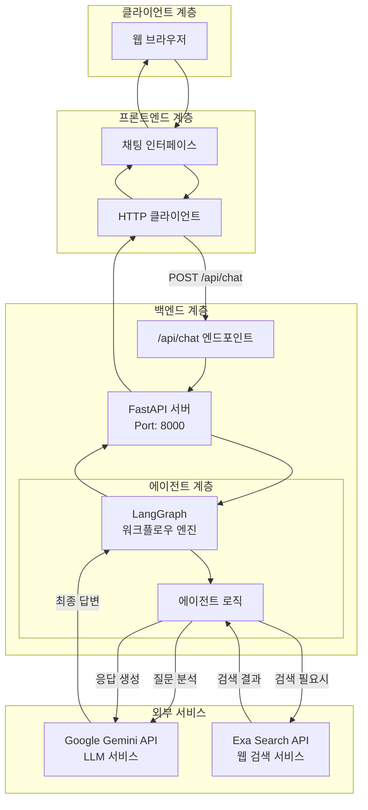
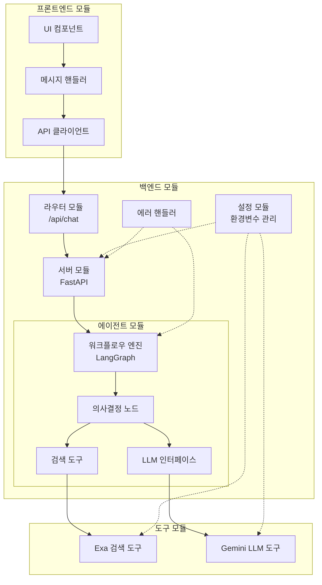
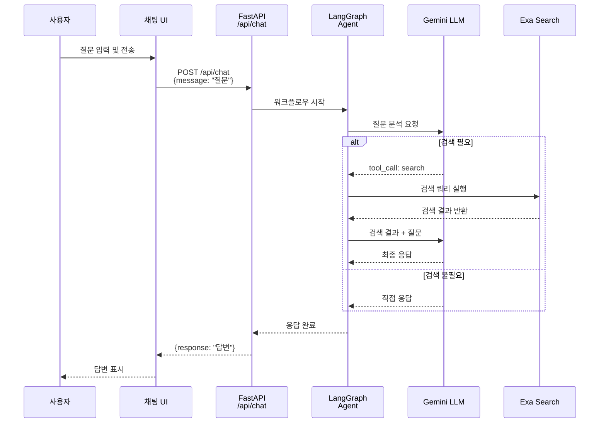
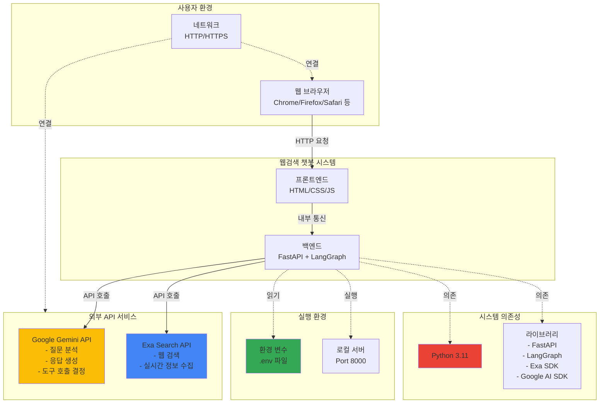
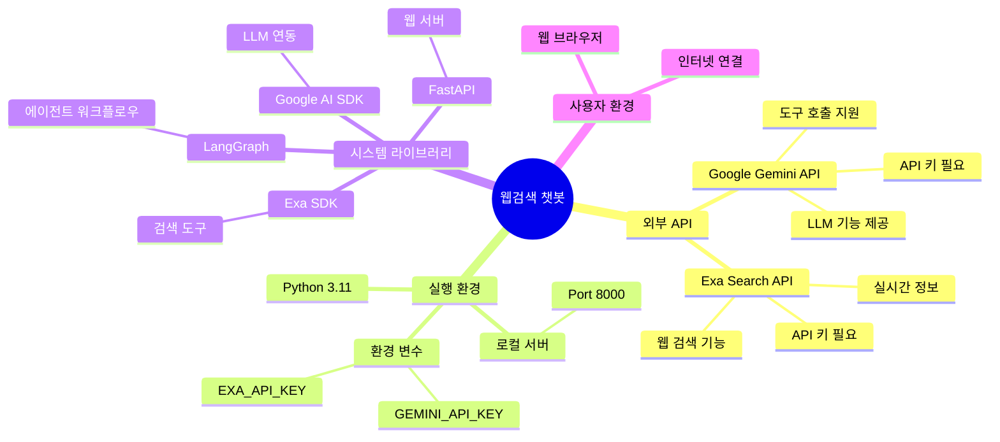

# 시스템 아키텍처

## 시스템 아키텍처



## 모듈화 및 컴포넌트



## API 및 인터페이스



### API 명세

```mermaid
flowchart LR
    subgraph Request["요청"]
        ReqMethod[Method: POST]
        ReqEndpoint[Endpoint: /api/chat]
        ReqBody[Body:<br/>{<br/> message: string<br/>}]
    end

    subgraph Response["응답"]
        ResStatus[Status: 200 OK]
        ResBody[Body:<br/>{<br/> response: string<br/>}]
    end

    subgraph ErrorResponse["에러 응답"]
        ErrStatus[Status: 500]
        ErrBody[Body:<br/>{<br/> detail: string<br/>}]
    end

    Request --> Response
    Request -.-> ErrorResponse
```

## 시스템 외부 환경과의 관계



### 외부 의존성



